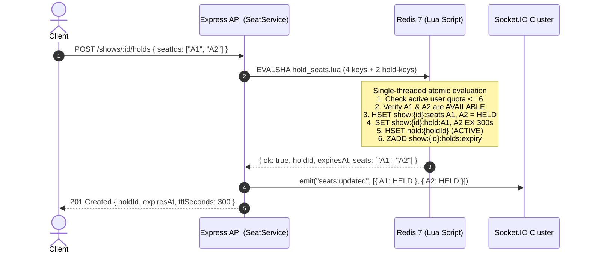

# TicketRush - Concurrency & Atomic Seat-Hold Engine

## Core Objective: ZERO Double-Booking Under High Concurrency

In flash-sale ticketing environments (e.g. BookMyShow, Ticketmaster), tens of thousands of users attempt to reserve the same finite set of seats within milliseconds. Standard relational or document database transactions with read-then-write checks in application code suffer from race conditions, deadlocks, and severe connection pool exhaustion.

TicketRush solves this by establishing **Redis as the authoritative source of truth for transient seat holds**, enforcing atomicity via single-threaded **Redis Lua scripts** loaded through `ioredis.defineCommand`.

---

## The 5 Concurrency Invariants

### Invariant 1: Single Occupancy
At any point in time $t$, for any show $S$ and seat $s$, the status of $s$ in `show:{S}:seats` is strictly one of:
$$\text{Status}(S, s) \in \{\text{AVAILABLE}, \text{HELD}, \text{BOOKED}\}$$
A transition from $\text{AVAILABLE} \to \text{HELD}$ is atomic. If $K$ concurrent requests target seat $s$, exactly **one** succeeds, and $K - 1$ receive an explicit `SEAT_UNAVAILABLE` rejection.

### Invariant 2: All-or-Nothing Atomicity (No Partial Holds)
If a user requests seats $\{s_1, s_2, \dots, s_n\}$:
- If **all** $s_i$ are $\text{AVAILABLE}$, all $s_i$ transition to $\text{HELD}$.
- If **any** $s_k$ is not $\text{AVAILABLE}$, the script aborts immediately without modifying any seat. None of the seats $\{s_1, \dots, s_n\}$ are marked held.

### Invariant 3: Per-User Seat Quota
A single user $U$ cannot hold more than `MAX_SEATS_PER_HOLD` (default: 6) active seats simultaneously across active holds for show $S$:
$$\sum_{h \in \text{ActiveHolds}(U, S)} |\text{Seats}(h)| + |\text{NewSeats}| \le \text{MAX\_SEATS\_PER\_HOLD}$$
The Lua script scans active holds recorded in `user:{U}:holds:{S}`, automatically pruning any expired hold references, and rejects requests exceeding the quota with `TOO_MANY_SEATS`.

### Invariant 4: Strict Hold Ownership
Only the user $U$ who initiated hold $H$ may release or confirm $H$. A hold key `show:{S}:hold:{s}` contains `${holdId}:${userId}`. During release, a seat is reverted to $\text{AVAILABLE}$ **only if** its individual hold-key still matches the specific `holdId`.

### Invariant 5: Durable Database Safety Net
Even in catastrophic disaster scenarios (e.g., Redis node restart or cache eviction), MongoDB acts as the ultimate durable barrier against double-booking through a unique compound partial index:
```javascript
bookingSchema.index(
  { showId: 1, 'seats.seatId': 1 },
  { unique: true, partialFilterExpression: { status: 'CONFIRMED' } }
);
```
No two confirmed bookings can ever contain the same seat ID for a show in MongoDB.

---

## Lua Scripts Architecture



### 1. `hold_seats.lua`
- **Keys**:
  - `KEYS[1]`: `show:{showId}:seats` (HASH: seatId $\to$ status)
  - `KEYS[2]`: `show:{showId}:holds:expiry` (ZSET: holdId scored by epoch ms)
  - `KEYS[3]`: `hold:{holdId}` (HASH: metadata)
  - `KEYS[4]`: `user:{userId}:holds:{showId}` (SET: holdIds)
  - `KEYS[5 ... 4+N]`: `show:{showId}:hold:{seatId_i}` (STRING: `${holdId}:${userId}`)
- **Arguments**: `showId`, `userId`, `holdId`, `ttlSeconds`, `nowMs`, `maxSeats`, `seatIds...`
- **Guarantees**: Atomic validation, zero partial updates, quota enforcement, and automated sweeper index registration.

### 2. `release_hold.lua`
- **Keys**: `holdHash`, `seatsHash`, `expiryZset`, `userHoldsSet`
- **Arguments**: `holdId`, `userId`, `showId`
- **Guarantees**: Validates user ownership and `ACTIVE` status. Reverts seats only if their hold key still points to this hold. Marks hold `RELEASED`, cleans up expiry ZSET and user holds SET.

### 3. `confirm_hold.lua`
- **Keys**: `holdHash`, `seatsHash`, `expiryZset`, `userHoldsSet`
- **Arguments**: `holdId`, `userId`, `showId`, `nowMs`, `bookingId`
- **Guarantees**: Transitions held seats to `BOOKED`, deletes transient seat hold keys, updates hold status to `CONFIRMED` with 24h audit retention, removes from sweeper queue.

### 4. `expire_holds.lua` (Sweeper)
- **Keys**: `seatsHash`, `expiryZset`
- **Arguments**: `showId`, `nowMs`, `batchLimit`
- **Guarantees**: Reclaims expired holds in batches using `ZRANGEBYSCORE`, atomically freeing seats back to `AVAILABLE` and returning freed seats for real-time Socket.IO emission.

---

## Verification & Stress Benchmarks

The test suite in `/server/tests/seat_hold.test.js` runs high-concurrency benchmarks directly against Redis:

1. **Hot Seat Contention**:
   - 200 concurrent `Promise.all` requests simultaneously attempt to reserve seat `B5`.
   - **Result**: Exactly 1 request succeeds (201 Created); 199 requests receive 409 `SEAT_UNAVAILABLE`.
2. **Flash Sale Mass Contention**:
   - 200 concurrent requests spread randomly across 150 venue seats (A1–J15).
   - **Result**: Zero duplicate seat reservations. Total seats held + available strictly equals 150.
3. **All-or-Nothing Atomicity**:
   - Multi-seat requests with a single conflicting seat leave all requested seats untouched.
4. **Automated TTL Expiry & Sweeper**:
   - Holds past their TTL are reclaimed and immediately reservable.
5. **Stability**:
   - Validated over **20 consecutive automated test runs** with zero race conditions or test flakes.
